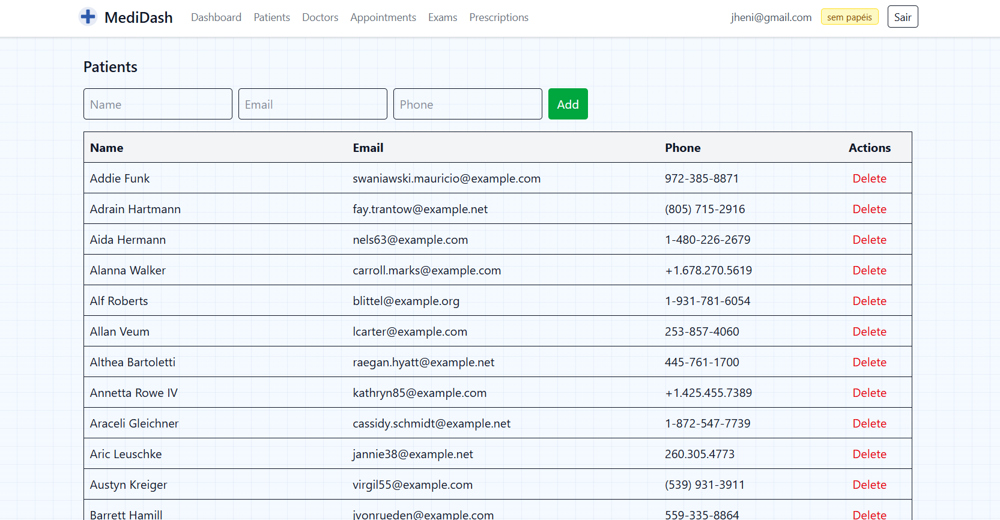
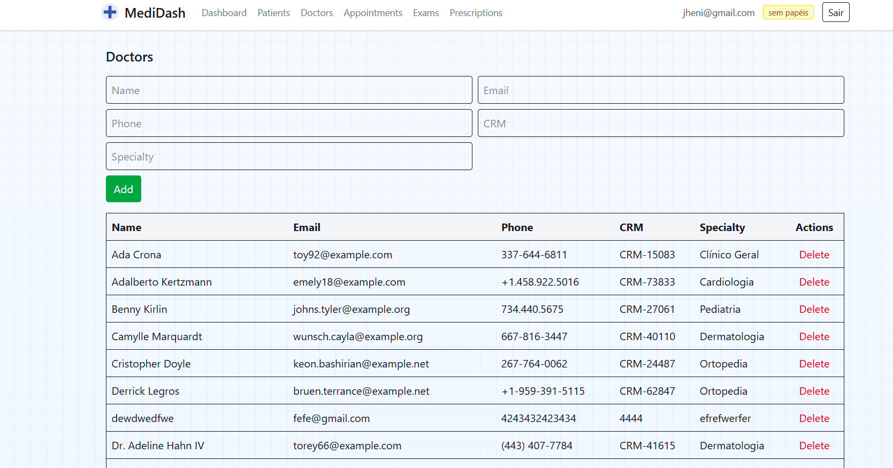

# MediDash — Clinic & Hospital Management System

MediDash is a modern, secure, and fast platform for managing clinics and hospitals. It provides an analytical dashboard and streamlined workflows for Patients, Doctors, Appointments, Exams, and Prescriptions with role-based access control.

## Features
- Analytical dashboard with KPIs and charts
- CRUD for Patients, Doctors, Appointments, Exams, and Prescriptions
- Role-Based Access Control (RBAC): Administrator, Doctor, Receptionist
- Secure authentication with Laravel Sanctum (token-based)
- Clean Architecture layout (Domain / Application / Infrastructure)
- Vue 3 SPA with Pinia for state management and Vue Router guards
- Fast build pipeline with Vite
- Automated tests with PHPUnit (Pest-ready structure)

## Screenshots

As capturas de tela abaixo mostram a aplicação em funcionamento. Todas as informações visíveis (nomes, e‑mails, telefones, números, gráficos, etc.) são dados fictícios gerados apenas para demonstração — não representam pessoas, instituições ou registros reais.

> As imagens estão referenciadas a partir de `docs/screenshots/img/`. Caso visualizadas no GitHub e não apareçam, verifique se os arquivos foram adicionados ao repositório com os nomes indicados.

Dashboard


Patients



Doctors



Exams


## Tech Stack
- Backend: `Laravel 10`, `PHP 8.x`, `Sanctum`, `Eloquent ORM`
- Frontend: `Vue 3`, `Pinia`, `Vue Router`, `Axios`, `Vite`
- Database: `SQLite` (dev-ready), compatible with MySQL/PostgreSQL
- Tooling: `Composer`, `Node.js`/`npm`

## Architecture Overview
- Domain: core entities and repository contracts
- Application: use cases and DTOs (extensible)
- Infrastructure: controllers, Eloquent models, repositories
- Http: controllers for web boundaries (kept thin)

Directory highlights:
```
app/
  Domain/          # Entities and Repositories contracts
  Http/            # Controllers for HTTP endpoints
  Infrastructure/  # Models, Controllers, Repositories (adapters)
resources/js/      # Vue 3 SPA (views, router, stores)
routes/            # api.php and web.php
database/          # migrations, seeders, sqlite database (dev)
```

## Getting Started

Prerequisites:
- PHP 8.x, Composer
- Node.js 18+ and npm

1) Install dependencies
```
composer install
npm install
```

2) Environment setup
```
cp .env.example .env
php artisan key:generate
```
By default, development uses `SQLite` at `database/database.sqlite`. If the file doesn’t exist:
```
type NUL > database\database.sqlite
```
Or configure another database in `.env`.

3) Migrate and seed
```
php artisan migrate
php artisan db:seed
```
Seeding creates a test user and base roles:
- Email: `test@example.com`
- Password: `password`
- Roles: `Administrator` (slug `admin`)

4) Build frontend assets
```
npm run build
```

5) Run the app
```
php artisan serve
```
Open: `http://127.0.0.1:8000/`

## Authentication & RBAC
- Authentication uses Sanctum personal access tokens.
- API responses from `login` and `register` include the user and their `roles`.
- Frontend: atualmente as rotas exigem apenas que o usuário esteja autenticado (sem checagem de papéis). Caso necessário, a checagem por papéis pode ser reativada no router.
- Backend: as Policies/Middlewares podem continuar aplicando regras de permissão por papéis.

## Frontend SPA
- Views:
  - `Dashboard.vue`, `Patients.vue`, `Doctors.vue`, `Appointments.vue`, `Exams.vue`, `Prescriptions.vue`, `Login.vue`, `Register.vue`
- Router: `resources/js/router/index.js` with guards and roles
- Store: `resources/js/stores/auth.js` for token and user state

## API Endpoints (summary)
- Auth: `POST /api/register`, `POST /api/login`, `POST /api/logout`, `GET /api/me`
- Dashboard: `GET /api/dashboard`
- Patients: `apiResource /api/patients`
- Doctors: `apiResource /api/doctors`
- Appointments: `apiResource /api/appointments`
- Exams: `apiResource /api/exams`
- Prescriptions: `apiResource /api/prescriptions`

Note: The SPA is configured to call API endpoints; ensure Axios base URL matches your setup.

## Testing
Run PHP tests:
```
phpunit
```
or
```
./vendor/bin/phpunit
```
Frontend unit tests can be added if needed; PHP feature and unit tests scaffold is present.

## Deployment Notes
- Configure environment variables for production (`APP_ENV`, `APP_KEY`, `DB_*`, `SANCTUM_STATEFUL_DOMAINS`, `SESSION_DOMAIN`).
- Run migrations and build frontend assets prior to release.
- Serve with your preferred web server (Nginx/Apache) pointing to `public/`.

## License
This project is provided as-is for demonstration and can be adapted to your needs.